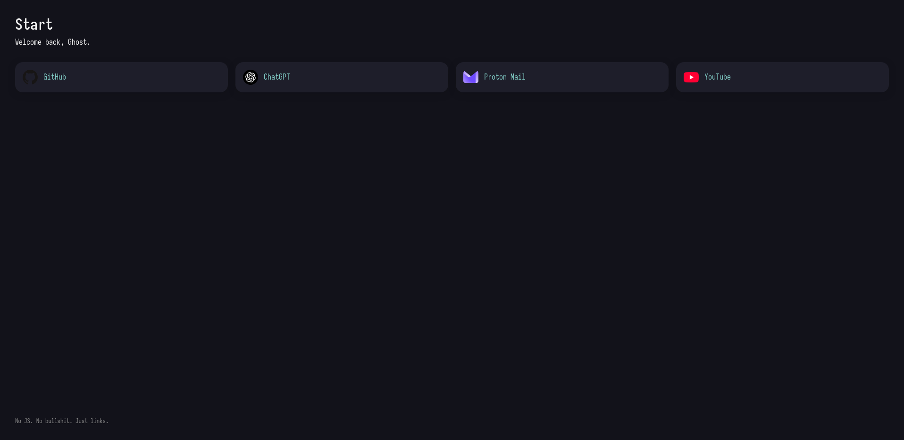

# Homepage html (and css) for librewolf 
##### This repo contains the homepage html (and css) I use for newtabs and start of the browser (librewolf) 

- I won't really maintain this unless I feel like it needs a change or it breaks  (Highly unlikely) 

(This repository is just for reference) 

